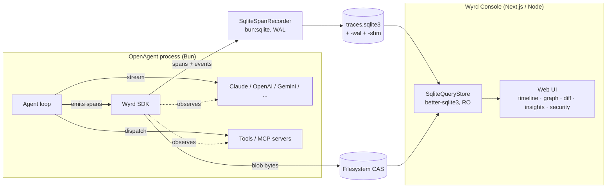
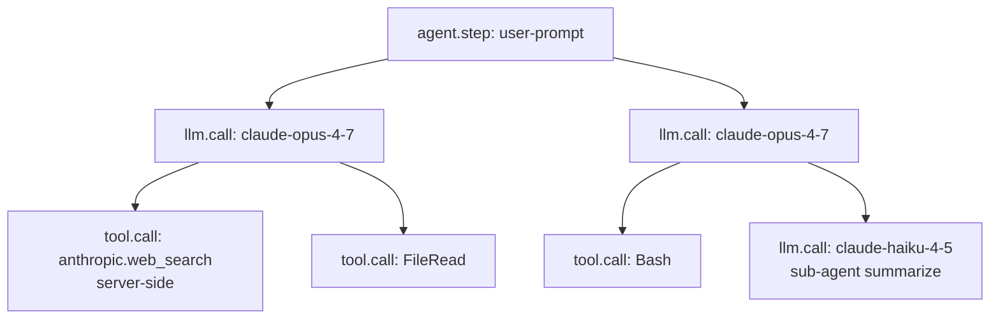

<h1 align="center">Wyrd</h1>

<p align="center">
  <strong>Time-travel debugger and execution tracer for AI agents.</strong><br>
  Capture every LLM call, tool invocation, and agent step. Replay any run deterministically. Inspect the full execution graph. Scan for prompt injection. 100% local.
</p>

<p align="center">
  <a href="LICENSE"></a>
  <a href="https://github.com/ask-sol/Wyrd/releases"></a>
  <a href="https://github.com/ask-sol/Wyrd/stargazers"></a>
  
  
  
  
  <a href="https://github.com/ask-sol/openagent"></a>
  
  
  <a href="https://github.com/ask-sol/Wyrd/pulls"></a>
</p>

<p align="center">
  <a href="#what-is-wyrd">What</a> •
  <a href="#why-wyrd">Why</a> •
  <a href="#features">Features</a> •
  <a href="#the-console">Console</a> •
  <a href="#architecture">Architecture</a> •
  <a href="#quick-start">Quick start</a> •
  <a href="#use-cases">Use cases</a> •
  <a href="#how-it-works">How it works</a> •
  <a href="#span-kinds">Span kinds</a> •
  <a href="#comparison">Compared</a> •
  <a href="#roadmap">Roadmap</a> •
  <a href="#faq">FAQ</a>
</p>

---

## What is Wyrd?

**Wyrd** is an open-source **execution tracing, observability, and replay debugger for AI agents and LLM applications**. Every reasoning step, model call, tool dispatch, memory read, and sub-agent spawn is captured as a structured **trace** — a directed acyclic graph of spans you can visualize on a timeline, inspect at any node, and **replay deterministically from local storage**.

If you build with autonomous LLM agents — whether on Claude, GPT-5, Gemini, open-source models, or anything in between — you already know the problem: agent loops are asynchronous, branched, and partially stochastic. A failure five tool calls deep is nearly impossible to reproduce with `console.log`. Token costs are opaque until the bill arrives. The prompt that produced last week's bad answer is gone forever. Existing observability tools — Datadog, OpenTelemetry collectors, traditional APM — were built for HTTP services, not for the prompt → completion → tool → memory → sub-agent execution graph that defines an autonomous AI system.

Wyrd is built specifically for that execution graph. Where Datadog gives you spans for HTTP services, Wyrd gives you spans for **agentic execution**: prompts, completions, tool I/O, token costs, finish reasons, and the causal links between them. Every span is content-addressed, every prompt is preserved by SHA-256 hash, and every trace can be replayed offline from local cache.

Named after the Anglo-Saxon word for *fate as a woven web of events*, Wyrd treats every agent run as an unalterable thread of what actually happened — preserved, inspectable, replayable.

The first reference runtime is [**OpenAgent**](https://github.com/ask-sol/openagent), the open-source Claude Code alternative. The schema is framework-neutral, so adapters for LangChain, LlamaIndex, AutoGen, CrewAI, and raw Anthropic / OpenAI / Gemini SDKs can be added without schema migrations.

---

## Why Wyrd?

| Problem | Without Wyrd | With Wyrd |
|---|---|---|
| Agent loops are async, branched, partially stochastic | `console.log` chaos, no causal view | Structured DAG with parent/child spans |
| You can't see the prompt that produced a bad answer | Re-run with prints, hope to repro | Click any `llm.call`, see the exact bytes sent |
| Tool calls fail silently mid-loop | Generic stack trace, no LLM context | `tool.call` span linked to its parent reasoning step |
| Token spend is opaque | Provider dashboard hours later | Per-subtree token + USD rollup, live as it streams |
| A bug from yesterday is unrecoverable | Lost forever unless you logged exhaustively | `wyrd replay <trace_id>` reruns from cache, byte-identical |
| You can't tell if a prompt was injected | Best case: read every log | Built-in `wyrd-guard` scanner runs on every span |
| Hosted observability ships your prompts to a SaaS | Privacy and compliance friction | **100% local. No telemetry. No phone-home.** |
| Each framework has its own tracing bolt-on | You vendor lock to that framework | Framework-neutral schema; adapters compose |
| Sharing a buggy trace with a teammate is painful | "Can you reproduce on your machine?" | Export a single `.wyrdpack` file; import on the other side |

Wyrd is for developers who want to understand and debug their agents the same way they debug software: with a record of execution, an interactive inspector, the ability to replay, and the ability to ask "what changed?" between two runs.

---

## Features

| Capability | Description |
|---|---|
| **Structured trace schema** | Framework-neutral `trace` / `span` / `event` / `link` model with stable wire format and ULID identifiers |
| **Closed span-kind enum** | `agent.step` · `llm.call` · `tool.call` · `tool.result` — small surface, large coverage |
| **Content-addressed blob store** | Prompts, completions, and tool I/O stored once by SHA-256 hash; identical content automatically deduplicated |
| **Canonical JSON hashing** | Deterministic content addressing regardless of object-key order — the substrate for replay |
| **SQLite + WAL storage** | Embedded, zero-config, concurrent readers and writers; arbitrary SQL over your traces |
| **Dual-runtime SQLite driver** | Works under both Bun (`bun:sqlite`) and Node.js (`better-sqlite3`) over the same database file |
| **Server-side tool capture** | Anthropic `web_search` and `code_execution` recorded as first-class child `tool.call` spans |
| **Live token streaming** | The recorder pushes progress updates while a model streams — tokens, cost, current activity climb in real time on the Live page |
| **Cached deterministic replay** | Re-run any historical trace byte-for-byte from local storage — no re-billing the LLM provider |
| **Cost & token rollups** | Per-span and per-subtree token + USD totals using OpenTelemetry GenAI semantic conventions |
| **Web console (Wyrd Console)** | Next.js dashboard: traces list, deep graph, timeline, replay, insights, diff, security, agents, store explorer |
| **Annotations** | Attach notes to a trace or any span. Severity tags (good example, bug, for-finetuning). Searchable. |
| **Trends dashboard** | Time-series of cost, tokens, throughput, p95 latency, error rate. Faceted by model / tool. |
| **Trace diff** | Pick two traces, see span-by-span deltas + word-level response text diff with green-add / red-remove highlighting |
| **Bundle export / import** | Single-file `.wyrdpack` (gzipped JSON) containing a trace + every referenced blob. Optional secret/PII sanitization on export. |
| **Built-in security scanner** | `wyrd-guard` — offline, regex + heuristic prompt-injection, jailbreak, secret, and PII detector. Works with any provider. |
| **Inferwall integration** | Optional drop-in for the open-source [Inferwall](https://docs.inferwall.com) AI firewall when its upstream wheel ships fixed. |
| **Local-first by design** | Single process, single machine, single user. No SaaS. No outbound network. No telemetry. |
| **OpenAgent-native** | Direct hooks into OpenAgent's `Provider` and tool-dispatch layers — no wrapping required |
| **TypeScript-strict SDK** | Full types for trace producers and consumers; ESM-first; Node ≥ 20; first-class Bun 1.3+ support |
| **Apache 2.0 licensed** | Truly open: read it, fork it, embed it, ship it |

---

## The Console

The Wyrd Console is a local Next.js dashboard (`cd ui && WYRD_DIR=$HOME/.wyrd npm run dev`) that gives you a Google Cloud–style, dark-mode operator view over your trace store.

| Route | What it does |
|---|---|
| `/` Traces | All captured runs. Search, filter by status / agent, sort by cost / duration / tokens. Annotation count chips. |
| `/trace/<id>` Trace detail | Five views: **Timeline** (chronological span strip) · **Graph** (deep, nested factor-tree of spans + virtual content blocks, messages, tool decls, search hits) · **Replay** (scrub through the trace with token-by-token playback) · **Security** (per-LLM-call scan results) · **Notes** (annotations). Plus an Inspector side panel that auto-renders Anthropic `web_search` hits as clickable result cards. |
| `/live` Live activity | In-flight traces with current span name, accumulating tokens, accumulating cost, sub-second polling. Configurable poll interval. |
| `/replays` Replays | Successful runs filtered for replay. Uses the same single-query aggregator as Traces. |
| `/insights` Insights | Time-series cost / tokens / traces / p95 duration / errors. Spend-by-model table. Tool usage breakdown (calls, errors, avg duration). |
| `/diff` Diff | Pick A vs B. Aggregate delta table. Span-by-span matching (matched / changed / a-only / b-only). Word-level response text diff. |
| `/agents` Agents | Unique `agent_id` values with version history, run counts, OK/error split, total tokens, total spend. |
| `/store` Store | Disk usage breakdown (SQLite + WAL + blobs), recent blobs, trace status distribution, Compact (VACUUM) / GC orphan blobs / Prune by retention. |
| `/settings` Settings | Inferwall manager (install / start / stop / view server log), live poll interval, retention. |

---

## Architecture



Five components: **SDK** (in-process emitter), **SQLite recorder** (writes spans + events under WAL), **filesystem CAS** (large payloads, immutable, content-addressed, two-level prefix layout), **SQLite query store** (read-only reader in the console — sees committed WAL pages concurrently with the writer), **Web Console** (timeline, deep graph, replay, insights, diff, security, annotations). No proxy, no Rust services, no cloud infrastructure.

### Storage: why SQLite + WAL

Wyrd briefly used DuckDB, but DuckDB enforces single-writer file locks: the OpenAgent process holding the writer would lock the console reader out. The fix was a clean switch to **SQLite with WAL (write-ahead log) mode**, which permits one writer and unlimited concurrent readers over the same file — exactly the topology of "agent emits traces while operator inspects the dashboard." Bun ships `bun:sqlite` natively; Node ships nothing, so the console uses `better-sqlite3`. Both speak the same on-disk format. The recorder lazy-detects which runtime it's in and loads the right driver.

### Example trace



A trace is one user request → final output, decomposed into spans. The graph view recursively expands each span into virtual child nodes (system prompt, individual messages, tool declarations, web-search result hits, parameters, token usage) so you can drill from "the agent ran" all the way down to "Claude's seventh search result was this URL." Hit replay; the whole tree re-runs deterministically from cache.

---

## Quick start

> **Status:** Wyrd is alpha. APIs may change before `0.1.0`. The schema and content-addressing layer are stable as of `0.0.1`.

### Install

```bash
npm install wyrd
# or
bun add wyrd
# or
pnpm add wyrd
```

### Run an OpenAgent session with tracing

```bash
# 1. Build and link wyrd
cd ~/Documents/GitHub/Wyrd && npm run build && npm link

# 2. Link wyrd into OpenAgent
cd ~/Documents/GitHub/openagent && npm link wyrd

# 3. Run OpenAgent from source with tracing on
WYRD_ENABLED=1 WYRD_DIR=$HOME/.wyrd bun run dev

# 4. Boot the Wyrd Console pointed at the same store
cd ~/Documents/GitHub/Wyrd/ui && WYRD_DIR=$HOME/.wyrd npm run dev
# open http://localhost:3737
```

Optional environment variables:

| Variable | Effect |
|---|---|
| `WYRD_ENABLED=1` | Activates tracing inside an OpenAgent session (no-op otherwise) |
| `WYRD_DIR=/path` | Override the default `./.wyrd` store directory |
| `WYRD_DEBUG=1` | Verbose stderr; e.g. logs each server-side tool span as it's recorded |
| `OPENAGENT_ANTHROPIC_WEB_SEARCH=1` | Opt-in to Anthropic's server-side `web_search` tool inside OpenAgent |
| `OPENAGENT_ANTHROPIC_CODE_EXECUTION=1` | Opt-in to Anthropic's server-side `code_execution` tool |

### Generate IDs and persist blobs manually

```ts
import {
  newTraceId,
  newSpanId,
  FilesystemBlobStore,
  canonicalJsonStringify,
  type Span,
} from 'wyrd';

const blobs = new FilesystemBlobStore('./.wyrd/blobs');
const trace_id = newTraceId();
const span_id = newSpanId();

// Persist a large prompt by reference (deduped automatically)
const promptRef = await blobs.putJson({
  messages: [{ role: 'user', content: 'Summarize this report' }],
});

const span: Span = {
  trace_id,
  span_id,
  parent_span_id: null,
  kind: 'llm.call',
  name: 'claude-opus-4-7',
  status: 'ok',
  started_at: Date.now(),
  ended_at: Date.now() + 1234,
  attributes: {
    'gen_ai.system': 'anthropic',
    'gen_ai.request.model': 'claude-opus-4-7',
    'gen_ai.usage.input_tokens': 1248,
    'gen_ai.usage.output_tokens': 412,
    'gen_ai.usage.cost_usd': 0.0093,
  },
  refs: { request: promptRef },
};

// Same logical request → same hash, regardless of key order
const cacheKey = canonicalJsonStringify({ model: 'claude-opus-4-7', temperature: 0.7 });
```

---

## Use cases

Wyrd is purpose-built for the moments when an AI agent surprises you — and you need answers fast.

- **Debugging Claude tool use, OpenAI function calls, and Anthropic server-side `web_search`.** Every model call and every tool dispatch is a first-class span. Click into any one, see the exact prompt, the exact response, the args sent to the tool, and the bytes that came back. Server-side tools that normally happen inside the model's pipeline — and are therefore invisible to most observability stacks — are reconstructed and recorded as if they were client-side.
- **Tracking token spend per agent, per prompt template, per model.** The Insights dashboard breaks down cost by model, time bucket, and tool. The trace list shows token totals on every row. When a teammate asks "why was last Tuesday $400?", you click the bar, see the offending traces, and drill in.
- **Prompt injection detection during development.** The built-in `wyrd-guard` scanner runs across every captured LLM input and output. It catches DAN-style jailbreaks, system-prompt overrides, leaked API keys (OpenAI, Anthropic, AWS, Google, GitHub, Stripe, Slack), SSNs, credit-card numbers, and more — without sending any of your prompts to a third party.
- **Regression review when you change a prompt or swap a model.** The Diff page picks any two traces and shows the per-span delta (cost, tokens, duration, tool sequence) plus a word-level response text diff with green additions and red strikethrough deletions.
- **Reproducing a bug that only happened once.** Cached deterministic replay means the trace you captured at 2 a.m. on Tuesday can be re-run, byte-identical, at 10 a.m. on Friday — without a single new dollar going to the LLM provider.
- **Sharing reproducible failures with teammates or the open-source community.** The Bundle export feature produces a single `.wyrdpack` file containing the trace, every referenced blob, and every annotation. Drop it into a GitHub issue or Slack DM. The recipient imports and reproduces locally.
- **Compliance and air-gapped environments.** Because Wyrd never makes outbound network calls, traces of regulated workloads — financial, medical, government, legal — stay on the machine that produced them. There is nothing to opt out of, no DPA to sign, no SaaS dependency to vet.

---

## How it works

Under the hood, Wyrd composes a small set of opinionated primitives.

**Spans are emitted, not pushed.** When an agent loop calls a wrapped provider or tool, the SDK opens a span handle and registers it with an async-local-storage trace context. The handle records `started_at` immediately and writes an in-progress span to the recorder so observers can see the work appearing. As the model streams text or tool calls, the recorder upserts the span with updated token estimates and cost — that's how the Live page's counters climb in real time.

**Every payload becomes a blob.** Prompts, completions, tool arguments, tool results — anything that might exceed a few hundred bytes — is hashed (SHA-256), written once to the content-addressed filesystem store, and referenced by hash from the relevant span. Two traces that send the same system prompt to the same model share one blob on disk. This is why one user with 10,000 traces against a 4 KB system prompt costs you 4 KB, not 40 MB.

**Canonical JSON normalizes the cache key.** Before hashing, request payloads are run through `canonicalJsonStringify` (an RFC 8785-lite implementation): object keys are sorted, primitive types are normalized, arrays preserve order. Two semantically identical requests produce the same hash even if your code constructs them in different orders. That's what makes deterministic replay possible.

**Reads run concurrent with writes.** SQLite WAL mode permits one writer and unlimited readers without blocking. The Wyrd Console opens read-only connections and queries the same trace database the OpenAgent process is actively writing to. WAL pages flush periodically; readers see consistent snapshots; you never have to "pause your agent to look at the dashboard."

**The schema is closed and intentional.** `SpanKind` is a closed enum: `agent.step`, `llm.call`, `tool.call`, `tool.result`. Adding a kind requires a deliberate schema migration — it's not a place where well-meaning contributions can accidentally fork the format. Well-known attribute keys follow OpenTelemetry GenAI semantic conventions wherever applicable, so traces interop with the broader observability ecosystem.

---

## Span kinds

| Kind | Meaning | Typical parent | Captures |
|---|---|---|---|
| `agent.step` | A unit of agent work — plan, reason, act, respond | another `agent.step` (or none for the root) | step label, iteration index |
| `llm.call` | A single model invocation | `agent.step` | request, response, tokens, cost, finish reason |
| `tool.call` | A tool invocation dispatched by the agent or executed server-side by the provider | `agent.step` or `llm.call` | tool name, side (`client`/`server`), args, result, duration |
| `tool.result` | A tool result observed via stream (provider-executed, no client dispatch) | `llm.call` or `agent.step` | tool name, result blob |

Span kinds are a **closed enum in v0.1**. Adding a new kind is a deliberate schema migration, not an ad-hoc addition. This is intentional: the kind drives the UI's per-node rendering, the replay engine's branching logic, and the cost analyzer.

### Well-known attributes

Wyrd follows [OpenTelemetry GenAI semantic conventions](https://opentelemetry.io/docs/specs/semconv/gen-ai/) where applicable:

```ts
'gen_ai.system'                  // 'anthropic' | 'openai' | 'google' | ...
'gen_ai.request.model'           // 'claude-opus-4-7'
'gen_ai.request.temperature'     // 0.7
'gen_ai.usage.input_tokens'      // 1248
'gen_ai.usage.output_tokens'     // 412
'gen_ai.usage.cost_usd'          // 0.0093
'gen_ai.response.finish_reason'  // 'end_turn' | 'tool_use' | 'stop_sequence'
'tool.name'                      // 'read_file'
'tool.side'                      // 'client' | 'server'
'tool.duration_ms'               // 12
'tool.safe_to_replay'            // true | false
```

---

## Storage layout

```
.wyrd/
├── traces.sqlite3            # spans, events, links, annotations
├── traces.sqlite3-wal        # write-ahead log (transient)
├── traces.sqlite3-shm        # shared memory index for WAL
├── console-config.json       # Wyrd Console settings
├── inferwall/                # Inferwall manager state (optional)
│   ├── server.log
│   ├── install.log
│   └── scan-cache.json
└── blobs/
    └── sha256/
        └── ab/
            └── cd/
                └── abcd1234...   # raw bytes, immutable
```

Two-level prefix (`ab/cd/`) keeps any single directory under ~64k entries. Blobs are immutable and content-addressed — the same system prompt across 10,000 traces becomes one file on disk. The SQLite file holds structured spans, events, links, and annotations; the WAL file holds in-flight transactions and is flushed periodically.

---

## Replay model

Wyrd's MVP supports **cached deterministic replay**. Every captured `llm.call` and `tool.call` is content-addressable; re-running a trace serves recorded responses from the local blob store, deterministically and offline. No re-billing the LLM provider, no flaky-network reproductions.

| Replay feature | v0.1 | v0.2 | v0.3 |
|---|:---:|:---:|:---:|
| Cached deterministic replay | ✅ | ✅ | ✅ |
| Step-by-step playback in UI | ✅ | ✅ | ✅ |
| Strict-mode divergence detection | ✅ | ✅ | ✅ |
| Per-tool determinism verification | ✅ | ✅ | ✅ |
| Side-by-side trace diff | ✅ | ✅ | ✅ |
| Counterfactual fork (modify + re-run live) | — | ✅ | ✅ |
| Live breakpoint / pause | — | — | ✅ |

Counterfactual branching ("what if this prompt were different?") is a v0.2 feature and depends on the underlying agent runtime adopting a snapshot-restartable execution loop.

---

## Comparison

| | **Wyrd** | LangSmith | Langfuse | Arize Phoenix | OpenLLMetry |
|---|:---:|:---:|:---:|:---:|:---:|
| Open source | ✅ Apache 2.0 | ❌ | ✅ MIT | ✅ Elastic | ✅ Apache 2.0 |
| Local-first / single-binary self-host | ✅ | ❌ SaaS | ✅ Docker | ✅ Docker | depends on backend |
| Deterministic replay from cache | ✅ | ❌ | ❌ | ❌ | ❌ |
| Native execution-graph DAG view | ✅ deep | ✅ | ✅ | ✅ | — |
| Tool-call observability (client + server) | ✅ first-class | ✅ client only | ✅ client only | ✅ client only | limited |
| Built-in prompt-injection scanner | ✅ `wyrd-guard` | ❌ | ❌ | partial | ❌ |
| Trace diff (response text + spans) | ✅ word-level | partial | partial | ❌ | ❌ |
| Trace bundle export / import | ✅ | ❌ | ❌ | ❌ | ❌ |
| Native OpenAgent integration | ✅ | ❌ | ❌ | ❌ | ❌ |
| OpenTelemetry GenAI conventions | ✅ | partial | ✅ | ✅ | ✅ |
| Zero outbound network | ✅ | ❌ | ✅ self-host | ✅ self-host | depends |
| Content-addressed blob store | ✅ | ❌ | ❌ | ❌ | ❌ |

---

## Roadmap

- [x] **0.0.x** — Schema, ULID identifiers, content-addressed blob store, canonical JSON hashing, SQLite + WAL recorder, OpenAgent integration, web console, annotations, diff, insights, bundle export/import, `wyrd-guard` scanner
- [ ] **0.1.0** — Stable public SDK API; published npm release; counterfactual fork groundwork
- [ ] **0.2.0** — Counterfactual fork + replay-with-edits; LangChain & raw Anthropic / OpenAI SDK adapters; goldens-style regression suite
- [ ] **0.3.0** — Self-host server mode; multi-user; ClickHouse upgrade path for huge stores
- [ ] **0.4.0** — Prompt-injection / tool-misuse static analysis on traces; embedding-based failure clustering
- [ ] **0.5.0** — Distributed tracing across processes; OTLP export

---

## FAQ

**Does Wyrd send my prompts anywhere?** No. Wyrd is local-first by design. Every span, blob, and replay artifact stays on your machine. There is no telemetry, no analytics, no remote backend.

**Is this a wrapper around an LLM provider?** No. Wyrd is observability infrastructure. It captures what your agent already does and never proxies, retries, or modifies your model calls.

**How is this different from OpenTelemetry?** Wyrd's schema is OTel-compatible at the attribute level (we follow the GenAI semantic conventions) but adds agent-specific span kinds, a content-addressed blob layer, and a replay engine — all of which OTel deliberately omits. You can think of Wyrd as "OTel for agents, with replay and security built in."

**Will Wyrd work with frameworks other than OpenAgent?** Adapters for LangChain, AutoGen, CrewAI, and raw Anthropic / OpenAI SDKs are planned for `0.2.0`. The schema is designed framework-neutral so those adapters do not require schema migrations.

**Why not just use logs?** Logs are flat. Agent execution is a graph. You need parent / child relationships, content-addressed payloads, and replay from cache to actually debug — not just to read.

**Why SQLite instead of DuckDB or Postgres?** SQLite with WAL mode is the only embedded SQL store that cleanly allows concurrent reader + writer access to the same file. DuckDB, which Wyrd briefly used, enforces single-writer locks — the OpenAgent process holding the writer locks the console reader out. Postgres would require a server. SQLite is single-file, zero-config, and battle-tested for exactly this topology.

**Does Wyrd work under Bun?** Yes. The recorder lazy-detects its runtime and uses `bun:sqlite` under Bun, `better-sqlite3` under Node. The console (Next.js) runs under Node; OpenAgent (which embeds the recorder) runs under Bun. Both read and write the same database file concurrently.

**Is the schema stable?** The shape (trace / span / event / link / blob ref) is stable. The closed `SpanKind` enum will only grow through deliberate schema migrations. Attribute keys follow OpenTelemetry GenAI conventions and inherit their stability.

**Can I scan traces for security issues?** Yes — every trace detail page has a Security tab. The built-in `wyrd-guard` scanner runs offline and catches prompt injection, jailbreaks, API key leaks, and PII. Optional integration with the [Inferwall](https://docs.inferwall.com) firewall is available when its upstream pip wheel ships fixed.

---

## Status

Wyrd is **pre-alpha**. The schema and the content-addressing layer are the canonical artifacts and are what we are stabilizing first. Expect breaking changes across `0.0.x`. Production use is not yet advised — but the surface area you'd be locking in (schema, attribute keys, blob layout) is small and considered.

If you'd like to follow along, ⭐ the repo and watch for the `0.1.0` release.

---

## Contributing

Issues and pull requests are welcome. High-leverage areas right now:

- Schema review — do the span kinds and well-known attributes cover your agent?
- SQLite query performance — index design for large stores (millions of spans)
- Web UI polish (deep-graph layout, replay UX, dark-mode tuning)
- Adapters for non-OpenAgent runtimes (post-`0.1.0`)
- `wyrd-guard` signature catalog — new prompt-injection / data-leak patterns

Please open an issue before submitting a substantial PR so we can align on direction.

---

## License

Apache 2.0 — see [LICENSE](LICENSE).

---

## Related projects

- [**OpenAgent**](https://github.com/ask-sol/openagent) — the open-source Claude Code alternative and Wyrd's first reference runtime.
- [OpenTelemetry GenAI semantic conventions](https://opentelemetry.io/docs/specs/semconv/gen-ai/) — Wyrd's attribute keys follow these where applicable.
- [SQLite](https://www.sqlite.org/) — embedded SQL engine; Wyrd's structured trace store, used in WAL mode for concurrent reader / writer access.
- [`better-sqlite3`](https://github.com/WiseLibs/better-sqlite3) — Node bindings used by the Wyrd Console.
- [`bun:sqlite`](https://bun.com/docs/api/sqlite) — Bun's built-in SQLite; used by the OpenAgent-side recorder.
- [Inferwall](https://docs.inferwall.com) — open-source AI firewall; optional Wyrd integration.
- [ULID](https://github.com/ulid/spec) — lexicographically sortable, time-prefixed identifiers used throughout Wyrd.

---

<sub>Wyrd /wɜːrd/ — Old English / Anglo-Saxon: the woven web of events, fate as what has come to pass.</sub>
