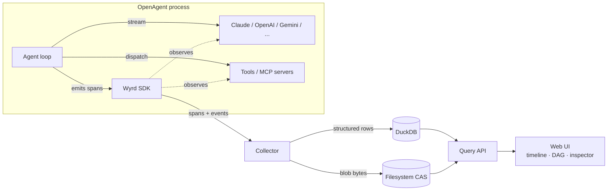
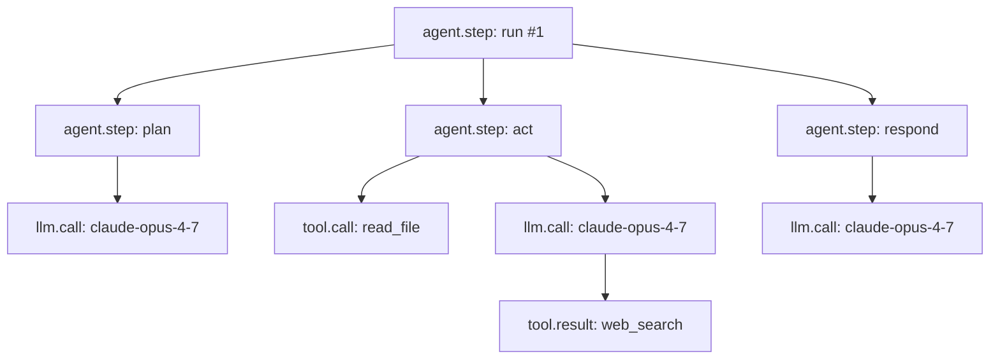

<h1 align="center">Wyrd</h1>

<p align="center">
  <strong>Time-travel debugger and execution tracer for AI agents.</strong><br>
  Capture every LLM call, tool invocation, and agent step. Replay any run deterministically. Inspect the full execution graph.
</p>

<p align="center">
  <a href="LICENSE"></a>
  <a href="https://github.com/ask-sol/Wyrd/releases"></a>
  <a href="https://github.com/ask-sol/Wyrd/stargazers"></a>
  
  
  
  <a href="https://github.com/ask-sol/openagent"></a>
  
  
  <a href="https://github.com/ask-sol/Wyrd/pulls"></a>
</p>

<p align="center">
  <a href="#what-is-wyrd">What</a> •
  <a href="#why-wyrd">Why</a> •
  <a href="#features">Features</a> •
  <a href="#architecture">Architecture</a> •
  <a href="#quick-start">Quick start</a> •
  <a href="#span-kinds">Span kinds</a> •
  <a href="#comparison">Compared</a> •
  <a href="#roadmap">Roadmap</a> •
  <a href="#faq">FAQ</a>
</p>

---

## What is Wyrd?

**Wyrd** is an open-source **execution tracing, observability, and replay debugger for AI agents**. Every reasoning step, model call, tool dispatch, memory read, and sub-agent spawn is captured as a structured **trace** — a directed acyclic graph of spans you can visualize on a timeline, inspect at any node, and **replay deterministically from local storage**.

If you build with autonomous LLM agents, you already know the problem: agent loops are asynchronous, branched, and partially stochastic. A failure five tool calls deep is nearly impossible to reproduce with `console.log`. Token costs are opaque until the bill arrives. The prompt that produced last week's bad answer is gone forever. Existing observability tools — Datadog, OpenTelemetry collectors, traditional APM — were built for HTTP services, not for the prompt → completion → tool → memory → sub-agent execution graph that defines an autonomous AI system.

Wyrd is built specifically for that execution graph. Where Datadog gives you spans for HTTP services, Wyrd gives you spans for **agentic execution**: prompts, completions, tool I/O, token costs, finish reasons, and the causal links between them. Every span is content-addressed, every prompt is preserved by SHA-256 hash, and every trace can be replayed offline from local cache.

Named after the Anglo-Saxon word for *fate as a woven web of events*, Wyrd treats every agent run as an unalterable thread of what actually happened — preserved, inspectable, replayable.

The first reference runtime is [**OpenAgent**](https://github.com/ask-sol/openagent), the open-source Claude Code alternative. The schema is framework-neutral, so adapters for LangChain, LlamaIndex, AutoGen, CrewAI, and raw Anthropic / OpenAI / Gemini SDKs can be added without schema migrations.

---

## Why Wyrd?

| Problem | Without Wyrd | With Wyrd |
|---|---|---|
| Agent loops are async, branched, partially stochastic | `console.log` chaos, no causal view | Structured DAG with parent/child spans |
| You can't see the prompt that produced a bad answer | Re-run with prints, hope to repro | Click any `llm.call`, see the exact bytes sent |
| Tool calls fail silently mid-loop | Generic stack trace, no LLM context | `tool.call` span linked to its parent reasoning step |
| Token spend is opaque | Provider dashboard hours later | Per-subtree token + USD rollup, live |
| A bug from yesterday is unrecoverable | Lost forever unless you logged exhaustively | `wyrd replay <trace_id>` reruns from cache, byte-identical |
| Hosted observability ships your prompts to a SaaS | Privacy and compliance friction | **100% local. No telemetry. No phone-home.** |
| Each framework has its own tracing bolt-on | You vendor lock to that framework | Framework-neutral schema; adapters compose |

Wyrd is for developers who want to understand and debug their agents the same way they debug software: with a record of execution, an interactive inspector, and the ability to replay.

---

## Features

| Capability | Description |
|---|---|
| **Structured trace schema** | Framework-neutral `trace` / `span` / `event` / `link` model with stable wire format and ULID identifiers |
| **Closed span-kind enum** | `agent.step` · `llm.call` · `tool.call` · `tool.result` — small surface, large coverage |
| **Content-addressed blob store** | Prompts, completions, and tool I/O stored once by SHA-256 hash; identical content automatically deduplicated |
| **Canonical JSON hashing** | Deterministic content addressing regardless of object-key order — the substrate for replay |
| **DuckDB query layer** | Columnar, embedded, zero-config; arbitrary SQL over your traces |
| **Cached deterministic replay** | Re-run any historical trace byte-for-byte from local storage — no re-billing the LLM provider |
| **Cost & token rollups** | Per-span and per-subtree token + USD totals using OpenTelemetry GenAI semantic conventions |
| **Web UI (timeline + DAG + inspector)** | Step through execution; click any node to see prompt, completion, tool I/O, latency, cost |
| **Replay controls** | Play / pause / step forward / step back over a captured trace |
| **Local-first by design** | Single process, single machine, single user. No SaaS. No outbound network. No telemetry. |
| **OpenAgent-native** | Direct hooks into OpenAgent's `Provider` and tool-dispatch layers — no wrapping required |
| **TypeScript-strict SDK** | Full types for trace producers and consumers; ESM-first; Node ≥ 20; works with Bun |
| **Apache 2.0 licensed** | Truly open: read it, fork it, embed it, ship it |

---

## Architecture



Five components: **SDK** (in-process emitter), **collector** (ingests, dedupes, persists), **DuckDB** (structured spans, events, links, refcounts), **filesystem CAS** (large payloads, immutable, content-addressed), **Web UI** (timeline, DAG, inspector with replay controls). No proxy, no Rust services, no cloud infrastructure.

### Example trace



A trace is one user request → final output, decomposed into spans. Click any node in the UI: see prompt, completion, tool args/results, token usage, cost, latency. Hit replay; the whole tree re-runs deterministically from cache.

---

## Quick start

> **Status:** Wyrd is alpha. APIs may change before `0.1.0`. The schema and content-addressing layer are stable as of `0.0.1`.

### Install

```bash
npm install wyrd
# or
bun add wyrd
# or
pnpm add wyrd
```

### Generate IDs and persist blobs

```ts
import {
  newTraceId,
  newSpanId,
  FilesystemBlobStore,
  hashCanonicalJson,
  type Span,
} from 'wyrd';

const blobs = new FilesystemBlobStore('./.wyrd/blobs');
const trace_id = newTraceId();
const span_id = newSpanId();

// Persist a large prompt by reference (deduped automatically)
const promptRef = await blobs.putJson({
  messages: [{ role: 'user', content: 'Summarize this report' }],
});

const span: Span = {
  trace_id,
  span_id,
  parent_span_id: null,
  kind: 'llm.call',
  name: 'claude-opus-4-7',
  status: 'ok',
  started_at: Date.now(),
  ended_at: Date.now() + 1234,
  attributes: {
    'gen_ai.system': 'anthropic',
    'gen_ai.request.model': 'claude-opus-4-7',
    'gen_ai.usage.input_tokens': 1248,
    'gen_ai.usage.output_tokens': 412,
    'gen_ai.usage.cost_usd': 0.0093,
  },
  refs: { prompt: promptRef },
};

// Same logical request → same hash, regardless of key order
const cacheKey = hashCanonicalJson({ model: 'claude-opus-4-7', temperature: 0.7 });
```

OpenAgent integration ships in milestone `0.1.0` — instrumentation will be one import + one constructor call inside an OpenAgent session.

---

## Span kinds

| Kind | Meaning | Typical parent | Captures |
|---|---|---|---|
| `agent.step` | A unit of agent work — plan, reason, act, respond | another `agent.step` (or none for the root) | step label, iteration index |
| `llm.call` | A single model invocation | `agent.step` | request, response, tokens, cost, finish reason |
| `tool.call` | A tool invocation dispatched by the agent | `agent.step` | tool name, args, result, duration |
| `tool.result` | A tool result observed via stream (provider-executed) | `llm.call` or `agent.step` | tool name, result blob |

Span kinds are a **closed enum in v0.1**. Adding a new kind is a deliberate schema migration, not an ad-hoc addition. This is intentional: the kind drives the UI's per-node rendering, the replay engine's branching logic, and the cost analyzer.

### Well-known attributes

Wyrd follows [OpenTelemetry GenAI semantic conventions](https://opentelemetry.io/docs/specs/semconv/gen-ai/) where applicable:

```ts
'gen_ai.system'              // 'anthropic' | 'openai' | 'google' | ...
'gen_ai.request.model'       // 'claude-opus-4-7'
'gen_ai.request.temperature' // 0.7
'gen_ai.usage.input_tokens'  // 1248
'gen_ai.usage.output_tokens' // 412
'gen_ai.usage.cost_usd'      // 0.0093
'tool.name'                  // 'read_file'
'tool.duration_ms'           // 12
```

---

## Storage layout

```
.wyrd/
├── traces.duckdb          # spans, events, links, blob refcounts
└── blobs/
    └── sha256/
        └── ab/
            └── cd/
                └── abcd1234...   # raw bytes, immutable
```

Two-level prefix (`ab/cd/`) keeps any single directory under ~64k entries. Blobs are immutable and content-addressed — the same system prompt across 10,000 traces becomes one file on disk. The DuckDB file holds structured spans, events, links, and a refcount per blob hash for garbage collection.

---

## Replay model

Wyrd's MVP supports **cached deterministic replay**. Every captured `llm.call` and `tool.call` is content-addressable; re-running a trace serves recorded responses from the local blob store, deterministically and offline. No re-billing the LLM provider, no flaky-network reproductions.

| Replay feature | v0.1 | v0.2 | v0.3 |
|---|:---:|:---:|:---:|
| Cached deterministic replay | ✅ | ✅ | ✅ |
| Step-by-step playback in UI | ✅ | ✅ | ✅ |
| Strict-mode divergence detection | ✅ | ✅ | ✅ |
| Counterfactual fork (modify + re-run live) | — | ✅ | ✅ |
| Side-by-side trace diff | — | ✅ | ✅ |
| Live breakpoint / pause | — | — | ✅ |

Counterfactual branching ("what if this prompt were different?") is a v0.2 feature and depends on the underlying agent runtime adopting a snapshot-restartable execution loop.

---

## Comparison

| | **Wyrd** | LangSmith | Langfuse | Arize Phoenix | OpenLLMetry |
|---|:---:|:---:|:---:|:---:|:---:|
| Open source | ✅ Apache 2.0 | ❌ | ✅ MIT | ✅ Elastic | ✅ Apache 2.0 |
| Local-first / single-binary self-host | ✅ | ❌ SaaS | ✅ Docker | ✅ Docker | depends on backend |
| Deterministic replay from cache | ✅ | ❌ | ❌ | ❌ | ❌ |
| Native execution-graph DAG view | ✅ | ✅ | ✅ | ✅ | — |
| Tool-call observability | ✅ first-class | ✅ | ✅ | ✅ | limited |
| Native OpenAgent integration | ✅ | ❌ | ❌ | ❌ | ❌ |
| OpenTelemetry GenAI conventions | ✅ | partial | ✅ | ✅ | ✅ |
| Zero outbound network | ✅ | ❌ | ✅ self-host | ✅ self-host | depends |
| Content-addressed blob store | ✅ | ❌ | ❌ | ❌ | ❌ |

---

## Roadmap

- [x] **0.0.x** — Schema, ULID identifiers, content-addressed blob store, canonical JSON hashing
- [ ] **0.1.0** — OpenAgent Claude provider + tool instrumentation; DuckDB collector; web UI; cached replay
- [ ] **0.2.0** — Counterfactual fork; trace diffing; LangChain & raw Anthropic / OpenAI SDK adapters
- [ ] **0.3.0** — Self-host server mode; multi-user; ClickHouse upgrade path
- [ ] **0.4.0** — Prompt-injection / tool-misuse static analysis on traces
- [ ] **0.5.0** — Distributed tracing across processes; OTLP export

---

## FAQ

**Does Wyrd send my prompts anywhere?** No. Wyrd is local-first by design. Every span, blob, and replay artifact stays on your machine. There is no telemetry, no analytics, no remote backend.

**Is this a wrapper around an LLM provider?** No. Wyrd is observability infrastructure. It captures what your agent already does and never proxies, retries, or modifies your model calls.

**How is this different from OpenTelemetry?** Wyrd's schema is OTel-compatible at the attribute level (we follow the GenAI semantic conventions) but adds agent-specific span kinds and a content-addressed blob layer that OTel deliberately omits. You can think of Wyrd as "OTel for agents, with replay built in."

**Will Wyrd work with frameworks other than OpenAgent?** Adapters for LangChain, AutoGen, CrewAI, and raw Anthropic / OpenAI SDKs are planned for `0.2.0`. The schema is designed framework-neutral so those adapters do not require schema migrations.

**Why not just use logs?** Logs are flat. Agent execution is a graph. You need parent / child relationships, content-addressed payloads, and replay from cache to actually debug — not just to read.

**Is the schema stable?** The shape (trace / span / event / link / blob ref) is stable. The closed `SpanKind` enum will only grow through deliberate schema migrations. Attribute keys follow OpenTelemetry GenAI conventions and inherit their stability.

---

## Status

Wyrd is **pre-alpha**. The schema and the content-addressing layer are the canonical artifacts and are what we are stabilizing first. Expect breaking changes across `0.0.x`. Production use is not yet advised.

If you'd like to follow along, ⭐ the repo and watch for the `0.1.0` release.

---

## Contributing

Issues and pull requests are welcome. High-leverage areas right now:

- Schema review — do the span kinds and well-known attributes cover your agent?
- DuckDB schema design and migration tooling
- Web UI prototypes (timeline + DAG + inspector)
- Adapters for non-OpenAgent runtimes (post-`0.1.0`)

Please open an issue before submitting a substantial PR so we can align on direction.

---

## License

Apache 2.0 — see [LICENSE](LICENSE).

---

## Related projects

- [**OpenAgent**](https://github.com/ask-sol/openagent) — the open-source Claude Code alternative and Wyrd's first reference runtime.
- [OpenTelemetry GenAI semantic conventions](https://opentelemetry.io/docs/specs/semconv/gen-ai/) — Wyrd's attribute keys follow these where applicable.
- [DuckDB](https://duckdb.org/) — embedded columnar SQL engine; Wyrd's structured trace store.
- [ULID](https://github.com/ulid/spec) — lexicographically sortable, time-prefixed identifiers used throughout Wyrd.

---

<sub>Wyrd /wɜːrd/ — Old English / Anglo-Saxon: the woven web of events, fate as what has come to pass.</sub>
